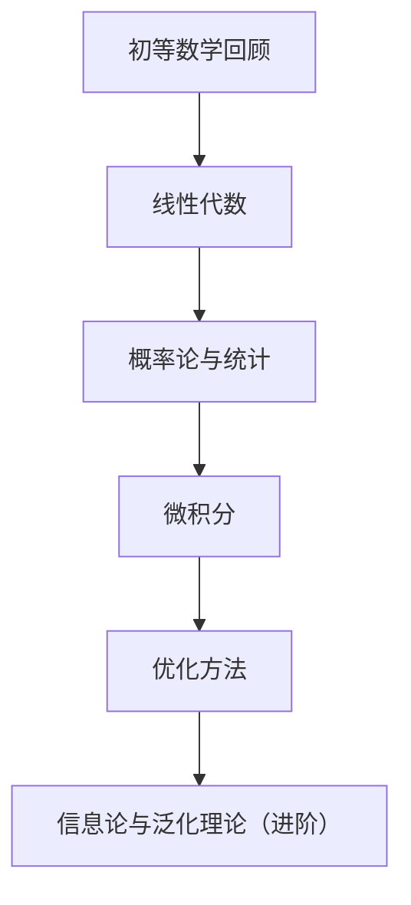

# 📚 机器学习导向的数学学习顺序

---

### ① **初等数学回顾**（如果你多年没碰数学）

| 内容       | 为什么重要             |
|------------|------------------------|
| 指数与对数 | 理解 log n / softmax / entropy |
| 函数图像    | 看懂模型曲线、损失函数变化      |
| 高中三角函数 | 有助于理解周期性输入 / 卷积核    |

✅ **建议**：可跳过，若你数学基础还不错可直接上线性代数。

---

### ② **线性代数（最优先）**

> 几乎所有 ML 模型底层都是矩阵操作！

| 核心知识     | 用途示例                           |
|--------------|------------------------------------|
| 向量、矩阵    | 特征表示、样本数据处理                 |
| 矩阵乘法      | 神经网络前向传播                       |
| 行列式、逆矩阵 | 线性回归解析解                       |
| 特征值/特征向量| PCA 降维、注意力机制（Self-Attention）  |
| 奇异值分解（SVD）| 推荐系统、压缩、协同过滤                |

✅ 推荐资源：  
- 《3Blue1Brown 线性代数系列》（YouTube）  
- 《Linear Algebra for ML》（机器学习专用线代）

---

### ③ **概率论与统计（重要）**

> 概率建模是机器学习核心：朴素贝叶斯、最大似然估计、EM算法等

| 核心知识           | 用途示例                              |
|--------------------|---------------------------------------|
| 概率基本法则         | 贝叶斯分类器、概率预测                     |
| 条件概率、联合概率     | 朴素贝叶斯、EM 算法                     |
| 期望、方差           | 模型不确定性分析、偏差-方差权衡            |
| 分布（正态、伯努利等） | 生成模型、高斯朴素贝叶斯                   |
| 最大似然估计（MLE）   | 参数学习核心思想                         |
| 假设检验、置信区间     | 评估模型效果（统计显著性）                 |

✅ 推荐资源：  
- Khan Academy 的概率课程  
- 《统计学习方法》（李航，经典中文教材）

---

### ④ **微积分（支撑优化算法）**

> 用于理解“模型如何学习”，特别是：**反向传播 + 梯度下降**

| 核心知识     | 用途示例                           |
|--------------|------------------------------------|
| 导数、偏导数  | 梯度下降（SGD, Adam）               |
| 链式法则      | 神经网络中的反向传播                 |
| 极值问题      | 损失函数最小化                       |
| 曲线的形状    | 学习率控制、优化收敛                  |

✅ 推荐资源：
- 3Blue1Brown 微积分动画（直观！）
- MIT OCW Calculus（系统严谨）

---

### ⑤ **优化方法（微积分 + 线代结合）**

> 模型训练的核心：“怎么找到最优参数”

| 内容         | 用途             |
|--------------|------------------|
| 梯度下降法      | 所有模型的核心训练方法    |
| 学习率与收敛性    | 模型训练稳定与高效性      |
| 正则化（L1/L2） | 防止过拟合，参数稀疏化     |
| 拉格朗日乘子法   | SVM 等优化问题建模        |

---

### ⑥ **信息论与泛化理论（进阶）**

> 想深入理解模型“为什么能学到东西”、“学到什么”

| 内容               | 应用                     |
|--------------------|--------------------------|
| 信息熵、交叉熵       | 分类损失函数、注意力机制      |
| KL 散度             | GAN、变分自编码器（VAE） |
| VC 维               | 模型复杂度与泛化能力        |
| Rademacher复杂度等 | 理论上的过拟合控制         |

---

## 🪜 推荐学习顺序（简化版）

| 学习阶段     | 对应数学模块                     |
|--------------|----------------------------------|
| 初学者       | Python + 线性代数 + 基础概率           |
| 进阶阶段     | 微积分 + 概率论 + 优化方法           |
| 高级阶段     | 泛化理论 + 信息论 + 理论理解          |