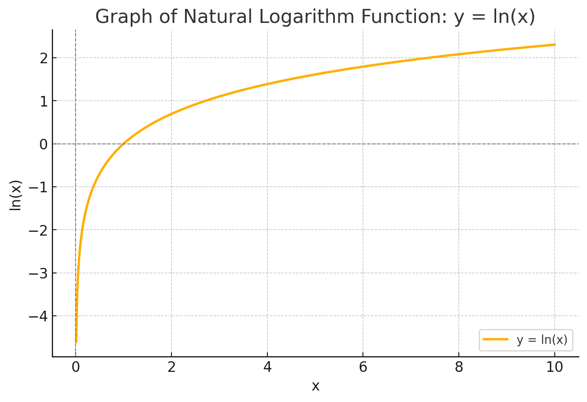

# 目录

[TOC]

# 概要

## 🧩 初等数学的必学概念（从零开始）

### 🟦 1. **数与运算基础**

| 概念         | 解释                                 |
|--------------|--------------------------------------|
| 自然数、整数、有理数、实数 | 数字的分类                            |
| 四则运算       | 加、减、乘、除的运算法则                    |
| 运算顺序（括号优先） | PEMDAS 原则（括号-指数-乘除-加减）         |
| 绝对值         | 表示一个数与 0 的距离，如 |−3| = 3       |
| 分数与小数     | 分数转换小数、无限循环小数                  |
| 百分比         | 利息、增长率、折扣等场景常用，例：30% = 0.3 |

---

### 🟦 2. **代数初步**

| 概念         | 解释                                       |
|--------------|--------------------------------------------|
| 变量与代数式   | 用字母表示未知数（如：x + 2 = 5）              |
| 解方程       | 一元一次方程、一元二次方程的解法               |
| 指数运算     | \(2^3 = 8\)，指数规则 \(a^m \cdot a^n = a^{m+n}\) |
| 对数概念     | log 是指数的“反函数”，如 \( \log_2(8) = 3 \)    |
| 括号展开与因式分解 | (x+1)(x+2) 展开为 \( x^2+3x+2 \)，反过来叫“因式分解” |

---

### 🟦 3. **函数与图像**

| 概念         | 解释                                     |
|--------------|------------------------------------------|
| 函数概念       | 每个输入 x 有唯一输出 y，y = f(x)             |
| 常见函数类型    | 线性函数、二次函数、指数函数、对数函数、分段函数 |
| 坐标系与图像    | 在 x-y 平面画出函数图像                      |
| 函数增长趋势    | 上升/下降、凹/凸、是否快速增长（如 log vs exp）|

---

### 🟦 4. **初等几何**

| 概念         | 解释                                     |
|--------------|------------------------------------------|
| 点、线、角、三角形 | 基础图形、角度计算、勾股定理                  |
| 圆的半径、直径、周长、面积 | \( C = 2\pi r \), \( A = \pi r^2 \)     |
| 面积与体积公式   | 矩形、圆、立方体、圆柱等常见形体              |
| 相似与全等     | 比例放大/缩小，几何推理基础                   |

---

### 🟦 5. **基础统计与数据概念**

| 概念       | 解释                                |
|------------|-------------------------------------|
| 平均数、中位数、众数 | 最基本的数据代表值                          |
| 数据可视化   | 画柱状图、折线图、饼图                        |
| 概率入门     | 掷骰子、抽卡、选人的基础概率计算                |

---

## ✨ 学习建议

- 每天学一点，每周复习总结一次
- 可以用图像和例子帮助理解（我可以帮你配图）
- 不必完美掌握，每块能看懂 70% 就足以继续往上学
- 遇到卡住的地方，随时来问我，我可以用**图、表、动画例子**讲解


# 课程结构

按“课本章节式”的方式，带你从**初等数学**系统学习，一步步建立扎实的数学基础。

---

## 📗 第1单元：数与四则运算

1.1 数的分类（自然数、整数、有理数、实数）  
1.2 四则运算规则（加减乘除的运算顺序）  
1.3 绝对值与相反数  
1.4 分数与小数的互化  
1.5 百分数与比（百分比、折扣、利率）

---

## 📘 第2单元：代数初步

2.1 变量与代数式  
2.2 一元一次方程的解法  
2.3 指数的运算规则  
2.4 对数的概念与基本性质  
2.5 因式分解与公式法则

---

## 📙 第3单元：函数与图像

3.1 函数的基本概念（输入、输出）  
3.2 坐标平面与函数图像  
3.3 线性函数与一次函数  
3.4 二次函数与抛物线  
3.5 对数函数与指数函数对比

---

## 📒 第4单元：初等几何基础

4.1 点、线、角、角度计算  
4.2 三角形与勾股定理  
4.3 圆的周长与面积  
4.4 常见图形面积与体积  
4.5 相似与全等、几何推理

---

## 📕 第5单元：基础统计与概率

5.1 平均数、中位数、众数  
5.2 简单的柱状图与数据可视化  
5.3 概率的定义与基本计算  
5.4 样本、实验、事件  
5.5 概率游戏与策略分析

---

## 🎯 学习方式建议：

每节课我会提供以下内容：

- ✅ 概念讲解（通俗易懂 + 举例）
- ✅ 图示（如有图形部分）
- ✅ 例题带练（你可选择跟做）
- ✅ 小测验（检验理解）

# 📗 第1单元：数与四则运算

## 第1单元 第1节：数的分类（Classification of Numbers）

在学数学之前，我们得先搞清楚——**“我们在研究什么样的数？”**  
这节课带你认识**所有常用的数的类型**，就像认识各种“数字家族成员”。

---

### 🧱 一、数的家族图（从小到大）

```text
实数（Real Numbers）
├── 有理数（Rational Numbers）
│   ├── 整数（Integers）
│   │   ├── 自然数（Natural Numbers）
│   │   └── 负整数（-1, -2, ...）
│   └── 分数/有限小数/无限循环小数（如 1/2, 0.25, 0.333...）
└── 无理数（Irrational Numbers）
    └── 不能化为分数的数，如 π、√2、e
```

---

### 📘 二、每种数具体介绍

#### 1️⃣ 自然数（Natural Numbers）

- 最基础的数，用来数数
- 包括：**1, 2, 3, 4, 5, ...**
- 有的教材包括 0，有的除外（我们暂时不算 0）

---

#### 2️⃣ 整数（Integers）

- 包括：**正整数、0、负整数**
- 举例：**... -3, -2, -1, 0, 1, 2, 3 ...**

---

#### 3️⃣ 有理数（Rational Numbers）

- **可以写成两个整数相除的形式：a/b**
- 包括：
  - 所有整数（如 3 = 3/1）
  - 所有分数（如 2/5, -7/8）
  - 有限小数（0.5 = 1/2）
  - 无限循环小数（0.333... = 1/3）

---

#### 4️⃣ 无理数（Irrational Numbers）

- **不能写成两个整数的比例**
- 小数部分无限不循环
- 常见例子：
  - \( \sqrt{2} = 1.41421356... \)（无规律地延伸下去）
  - \( \pi = 3.14159... \)
  - \( e ≈ 2.718... \)

---

#### 5️⃣ 实数（Real Numbers）

- 所有在数轴上能找到的位置，都是“实数”
- = 有理数 + 无理数

---

### 📝 三、例题练习：判断下列属于什么数

| 数值        | 自然数 | 整数 | 有理数 | 无理数 | 实数 |
|-------------|--------|------|--------|--------|------|
| 3           | ✅     | ✅   | ✅     | ❌     | ✅   |
| 0           | （有争议） | ✅   | ✅     | ❌     | ✅   |
| -5          | ❌     | ✅   | ✅     | ❌     | ✅   |
| 0.25        | ❌     | ❌   | ✅     | ❌     | ✅   |
| 0.333...    | ❌     | ❌   | ✅     | ❌     | ✅   |
| √2          | ❌     | ❌   | ❌     | ✅     | ✅   |
| π           | ❌     | ❌   | ❌     | ✅     | ✅   |

---

### ✅ 小结：你记住了吗？

| 概念         | 快速记忆法                                 |
|--------------|--------------------------------------------|
| 自然数       | 拿来数数的：1, 2, 3, …                     |
| 整数         | 自然数 + 0 + 负数                          |
| 有理数       | 能写成 a/b 的（整数、小数、分数）           |
| 无理数       | 不能写成 a/b 的怪家伙（π, √2）              |
| 实数         | 所有这些数的总称                           |

---

### 📌 下一节预告（第1单元第2节）：

我们将进入 **“四则运算的运算顺序”**：  
加减乘除能乱来吗？先乘除还是先加减？括号怎么处理？负号和绝对值又怎么结合？  
我会配图和例子一一讲解！

## 📗 第1单元 第2节：四则运算顺序（运算的优先级）

这一节我们来解决一个常见但非常重要的问题：

> **数学表达式里，到底先算谁？加减乘除能随便来吗？括号什么时候处理？**

---

### 🎯 一、四则运算的优先级规则

我们在数学中遵循这样一个顺序：

```text
括号 → 指数（乘方）→ 乘除 → 加减
```

记忆口诀：**“括指乘除加减”**，英文常用缩写是 **PEMDAS**：

| 缩写 | 含义         | 中文含义         |
|------|--------------|------------------|
| P    | Parentheses  | 括号              |
| E    | Exponents    | 指数（乘方）       |
| MD   | Multiply/Divide | 乘除（从左到右）   |
| AS   | Add/Subtract | 加减（从左到右）   |

---

### 🧪 二、例题演示

#### 例1：  
\[
3 + 5 \times 2 = ?
\]

> 按优先级：  
> 先算乘法：\(5 \times 2 = 10\)  
> 再加法：\(3 + 10 = 13\)  
✅ 答案是：**13**

---

#### 例2：  
\[
(3 + 5) \times 2 = ?
\]

> 有括号，先算括号：\(3 + 5 = 8\)  
> 然后乘法：\(8 \times 2 = 16\)  
✅ 答案是：**16**

---

#### 例3：  
\[
12 ÷ 3 \times 2 = ?
\]

> 乘除从左到右：  
> 先 \(12 ÷ 3 = 4\)  
> 再 \(4 \times 2 = 8\)  
✅ 答案是：**8**

---

#### 例4：  
\[
8 - 4 + 2 = ?
\]

> 加减也是从左到右：  
> 先 \(8 - 4 = 4\)，再 \(4 + 2 = 6\)  
✅ 答案是：**6**

---

### 🧱 三、特殊注意点

| 错误思路               | 正确理解                     |
|------------------------|------------------------------|
| “乘法比除法优先” ❌     | ✅ 乘除同优先，从左到右         |
| “先减后加” ❌           | ✅ 加减同优先，从左到右         |
| “括号不重要” ❌         | ✅ 括号最高优先，一定要先算括号  |
| “负号和乘除无顺序” ❌   | ✅ 要结合运算顺序判断         |

---

### 📝 四、你试试看（练习题）

1. \( 4 + 6 \div 2 =\)  
2. \( (4 + 6) \div 2 =\)  
3. \( 7 - 2 \times 3 = \)  
4. \( (7 - 2) \times 3 = \)  
5. \( 18 \div 3 \div 2 = \)  
6. \( 8 + 4 \times (3 - 1) = \)


## 📗 第1单元 第3节：**绝对值与相反数**

这节课我们来认识两个简单却非常实用的概念：  
🔹 **绝对值（Absolute Value）**  
🔹 **相反数（Additive Inverse）**

---

### 🧊 一、什么是绝对值？

#### ✅ 定义：

> 一个数的绝对值，是它**到原点 0 的距离**，不考虑方向。

#### 📌 记号：
- 绝对值写作：`|a|`
- 举例：
  - \( |5| = 5 \)
  - \( |-5| = 5 \)
  - \( |0| = 0 \)

💡 小结：**绝对值就是“去掉正负号”**

---


### ♻️ 二、什么是相反数？

#### ✅ 定义：

> 相反数是“与原数相加为 0 的另一个数”。

- 举例：
  - 5 的相反数是 −5，因为 \(5 + (-5) = 0\)
  - −7 的相反数是 7，因为 \( -7 + 7 = 0 \)
  - 0 的相反数是它自己：0

---

## 📗 第1单元 第4节：**分数与小数的互化 + 运算技巧**

这一节我们来学习：

- 分数 ↔ 小数 的相互转换  
- 有限小数、无限循环小数  
- 分数的加减乘除规则  
- 运算中的通分、约分技巧

---

### 🧮 一、分数与小数的互化

#### ✅ 分数变小数（除法）

> 分数 = **分子 ÷ 分母**

| 分数     | 计算方式   | 小数形式   |
|----------|------------|------------|
| \( \frac{1}{2} \) | 1 ÷ 2 =     | 0.5        |
| \( \frac{3}{4} \) | 3 ÷ 4 =     | 0.75       |
| \( \frac{1}{3} \) | 1 ÷ 3 =     | 0.333...   |
| \( \frac{2}{7} \) | 2 ÷ 7 =     | 0.285714...（循环） |

---

#### ✅ 小数变分数

分两种情况：

##### ✳️ 有限小数 → 分数（直接写）

| 小数  | 分数形式       |
|-------|----------------|
| 0.5   | \( \frac{1}{2} \)   |
| 0.25  | \( \frac{1}{4} \)   |
| 0.75  | \( \frac{3}{4} \)   |

🧠 记住：  
小数点后1位 → 分母是10  
小数点后2位 → 分母是100  
比如：0.25 = 25/100 = 1/4（约分）

---

##### ♾️ 无限循环小数 → 分数（记住几个经典）

| 小数           | 分数           |
|----------------|----------------|
| 0.333...       | \( \frac{1}{3} \) |
| 0.666...       | \( \frac{2}{3} \) |
| 0.142857...    | \( \frac{1}{7} \) |
| 0.111...       | \( \frac{1}{9} \) |

👉 更复杂的可以用代数法转换（后续进阶再讲）

---

### ➕ 二、分数的加减乘除法则

#### ✅ 分数加减法

- **通分 + 加减分子**
- 分母相同直接算分子，分母不同先通分

例：
\[
\frac{1}{4} + \frac{1}{4} = \frac{2}{4} = \frac{1}{2}
\]  
\[
\frac{1}{2} + \frac{1}{3} = \frac{3}{6} + \frac{2}{6} = \frac{5}{6}
\]

---

#### ✅ 分数乘法

> 直接乘上下：
\[
\frac{2}{3} \times \frac{3}{4} = \frac{6}{12} = \frac{1}{2}
\]

---

#### ✅ 分数除法

> 除以一个分数 = 乘以它的倒数：
\[
\frac{2}{3} ÷ \frac{3}{4} = \frac{2}{3} \times \frac{4}{3} = \frac{8}{9}
\]

---

### 📌 三、约分与通分技巧

#### ✂️ 约分（把分数“缩小”）

\[
\frac{20}{30} = \frac{2}{3} \quad （同时除以 10）
\]

#### 🔄 通分（加减前“对齐”分母）

\[
\frac{1}{3} + \frac{1}{4} = \frac{4}{12} + \frac{3}{12} = \frac{7}{12}
\]

---

### 📝 小练习（你试试看）

1. \( \frac{1}{2} + \frac{1}{3} = \)  
2. \( \frac{3}{4} \times \frac{2}{5} = \)  
3. \( \frac{4}{9} ÷ \frac{2}{3} = \)  
4. 0.75 转为分数 =  
5. \( \frac{5}{8} - \frac{1}{4} = \)

太好了！我们现在进入：

---

## 📗 第1单元 第5节：**百分数与比（Ratio & Percent）**

这节课将带你掌握生活中经常遇到的概念，比如：
- 折扣 30%
- 利息 2%
- 打折、涨价、数据增长率
- 1:2 的比例代表什么？

这些知识不仅考试常考，更是**日常生活和工作中必须掌握的技能！**

---

### 🧮 一、什么是百分数（Percent）？

#### ✅ 定义：

> 百分数表示“以 100 为单位的份数”，  
> 通常写作：**a%**，表示 **a/100**

---

#### 📌 示例：

| 百分数   | 分数形式     | 小数形式 |
|----------|--------------|----------|
| 25%      | \( \frac{25}{100} \) | 0.25     |
| 50%      | \( \frac{1}{2} \)     | 0.5      |
| 120%     | \( \frac{6}{5} \)     | 1.2      |
| 0.5%     | \( \frac{1}{200} \)   | 0.005    |

---

#### 💡 快速记法：

| 写法    | 意思               |
|---------|--------------------|
| 100%    | 原来的全部         |
| 50%     | 一半               |
| 200%    | 原来的两倍         |
| −20%    | 降低了 20%         |

---

### 🛒 二、百分数的实际应用

#### 🎯 1. 折扣（打几折？）

- 80% = 打 8 折（只付 80% 的钱）
- 60% = 打 6 折（付 60%，省下 40%）

例：
- 一件衣服原价 200 元，打 8 折：  
  \(200 × 0.8 = 160\) 元

---

#### 🎯 2. 涨价 or 降价（价格变化）

- **涨价 20%** → 乘 1.2  
- **降价 30%** → 乘 0.7

例：
- 商品原价 100 元，涨价 20%  
  \(100 × 1.2 = 120\) 元

---

#### 🎯 3. 利息（年利率）

- 如果年利率为 5%，本金是 1000 元  
  一年利息是：\(1000 × 0.05 = 50\) 元

---

### 🧊 三、比（Ratio）的概念

#### ✅ 定义：

> 比（Ratio）是**两个数的比较**，表示“前者是后者的几倍”

- 写作：1:2、3:5、4:7 等
- 读作：**“1 比 2”、“3 比 5”**

---

#### 📌 例子：

| 场景                      | 比例表达         |
|---------------------------|------------------|
| 男生：女生 = 2：3         | 男占 2 份，女占 3 份，共 5 份 |
| 水：牛奶 = 1：4           | 每 1 杯水配 4 杯牛奶        |
| 红球：白球：黑球 = 2：3：5 | 总共 10 份            |

---

#### 🎯 比与总量的应用：

> 如果一个班级男女比是 3:2，班里有 30 人，  
> 男女各有多少人？

总份数 = 3 + 2 = 5  
- 男生 = \(30 × \frac{3}{5} = 18\)  
- 女生 = \(30 × \frac{2}{5} = 12\)

---

### 📝 小练习（你试试看）

1. 80% 转换为分数 =  
2. 衣服原价 150 元，打 7 折后多少钱？  
3. 男：女 = 2:3，总共 40 人，女有几人？  
4. 价格上涨 25%，原价 400 元，涨后多少？  
5. 1:4 的混合比例中，水占总量的几分之几？

---

🎉 至此，第1单元《数与四则运算》我们全部学完啦！  
你现在掌握了：

✅ 数的分类  
✅ 四则运算顺序  
✅ 绝对值与相反数  
✅ 分数小数转换与运算  
✅ 百分比与比的应用

---

# 📘 第2单元：**代数初步**

> 从“算具体数”，进入“解未知数”的世界 🧩  
> 本单元的目标是掌握：**用字母表示数、列表达式、解方程**，为将来的函数与机器学习打好基础。

---

## ✅ 第2单元总览

| 章节             | 内容简要                          |
|------------------|-----------------------------------|
| 2-1️⃣ 变量与代数式     | 学会用字母表示数，例如 \( x + 2 \)       |
| 2-2️⃣ 解一元一次方程   | 解“只有一个未知数”的等式，例如 \( x + 3 = 5 \) |
| 2-3️⃣ 指数运算         | 学习 \( 2^3 \)、指数规则                  |
| 2-4️⃣ 对数的入门理解   | 什么是 log？为什么是指数的“反函数”？        |
| 2-5️⃣ 常见公式和因式分解 | (a + b)² 展开，反过来怎么拆？              |

---

## 📘 第2单元 第1节：**变量与代数式**

---

### 🔤 一、什么是变量？

- 变量就是**可以变化的数**，我们用字母来表示它  
- 最常用的字母是：x, y, a, b...

🔍 举例：

| 表达      | 意思                         |
|-----------|------------------------------|
| \( x + 2 \) | x 加 2                      |
| \( 2x \)   | 2 乘以 x                    |
| \( x - 3 \) | x 减 3                      |
| \( ab \)   | a × b（省略乘号）             |

---

### 🔧 二、代数式的组成

代数式通常由以下三部分构成：

| 部分     | 举例                 | 含义说明                    |
|----------|----------------------|-----------------------------|
| **变量** | x、y、a、b           | 表示未知数                 |
| **系数** | 2x 中的 2            | 表示变量前面的倍数          |
| **常数** | \( x + 3 \) 中的 3   | 固定数，不变的量            |

---

### 🧠 三、常见代数式例子

| 表达式       | 文字解释                     |
|--------------|------------------------------|
| \( x + 5 \)   | x 加 5                       |
| \( 3x - 2 \)  | 3 倍的 x 减 2                |
| \( ab \)      | a 与 b 相乘                  |
| \( \frac{x}{2} \) | x 除以 2                    |
| \( x^2 \)      | x 的平方                     |

---

### ✨ 四、代数式的简化规则（初步）

| 运算       | 规则示例                          |
|------------|-----------------------------------|
| 合并同类项   | \( 2x + 3x = 5x \)                |
| 去括号     | \( 2(x + 3) = 2x + 6 \)            |
| 分配律     | \( a(b + c) = ab + ac \)           |
| 指数运算   | \( x \cdot x = x^2 \)              |

---

### 📝 小练习：判断下列表达式的含义

1. \( 4x \) 表示什么？  
2. \( x + 7 \) 是哪个数的 7 倍？  
3. \( 2x + 3x \) 简化后是多少？  
4. 用“a 加 b 再乘 2”写一个代数式  
5. \( 5(x - 2) \) 展开后是多少？

---

## 📘 第2单元 第2节：**一元一次方程的解法入门**

这是代数的第一大重点：**解方程**。  
我们现在开始学会——**如何“找出未知数”**。

---

### 🔍 一、什么是一元一次方程？

#### ✅ 定义：

> 一元一次方程是**只含一个未知数 x，且次数为 1 的方程**。

比如：

\[
x + 3 = 7
\]

目标就是：**找出哪个 x 可以让等式成立。**

---

#### 📌 一元一次方程的标准形式：

\[
ax + b = c
\]

其中：
- \( a \) 是 x 的系数（倍数）
- \( b \) 是常数项
- \( c \) 是右边常数

---

### 🛠️ 二、解方程的基本步骤

#### 📌 例题：解 \( x + 3 = 7 \)

##### 步骤 1：让 x 单独一边（移项）

\[
x = 7 - 3
\Rightarrow x = 4
\]

---

#### 📌 再看一个复杂一点的：

解：\( 2x - 5 = 11 \)

#### 步骤 1：移项（把 −5 移过去）

\[
2x = 11 + 5 = 16
\]

#### 步骤 2：消除系数（除以 2）

\[
x = 16 ÷ 2 = 8
\]

✅ 解得：\( x = 8 \)

---

### 💡 常见操作说明

| 操作     | 举例                         | 目的                         |
|----------|------------------------------|------------------------------|
| 加减移项 | \( x + 3 = 5 \rightarrow x = 5 - 3 \) | 让 x 单独一边                |
| 乘除消元 | \( 2x = 8 \rightarrow x = 8 ÷ 2 \) | 去掉 x 前的倍数              |
| 整理方程 | \( 3x + 2 = 2x + 7 \)         | 两边都有 x，需要合并再移项      |

---

### 🧪 三、练习题（解出 x）

1. \( x + 5 = 12 \)  
2. \( 3x = 15 \)  
3. \( 2x - 3 = 9 \)  
4. \( 4x + 2 = 3x + 9 \)  
5. \( 6 - x = 10 \)

---

## 📘 🔴重要🔴 第2单元 第3节：**指数运算规则（幂运算的世界）**

这一节我们将学习指数（幂）的基本概念和运算规则。

---

### 🌱 一、什么是指数？

#### ✅ 基本形式：


\[
a^n = \underbrace{a \times a \times \dots \times a}_{n\text{ 个 a 相乘}}
\]

- **a**：底数（base）  
- **n**：指数或幂（exponent or power）  
- 读作 “a 的 n 次方”

---

#### 📌 含义说明：

\[
2^3 = 2 × 2 × 2 = 8
\]

\[
5^2 = 5 × 5 = 25
\]

\[
10^1 = 10
\]

\[
x^4 = x × x × x × x
\]

---

### 📐 二、指数的常用规则（记住这 6 条就够了）

| 规则名称       | 形式                             | 示例                          |
|----------------|----------------------------------|-------------------------------|
| **乘法规则**     | \( a^m \cdot a^n = a^{m+n} \)     | \( 2^3 \cdot 2^2 = 2^5 = 32 \) |
| **除法规则**     | \( \frac{a^m}{a^n} = a^{m-n} \)   | \( \frac{5^4}{5^2} = 5^2 \)    |
| **括号规则**     | \( (a^m)^n = a^{m \cdot n} \)     | \( (3^2)^3 = 3^6 \)            |
| **乘积括号规则** | \( (ab)^n = a^n \cdot b^n \)      | \( (2x)^3 = 2^3 x^3 \)         |
| **零次方**       | \( a^0 = 1 \quad (a ≠ 0) \)        | \( 7^0 = 1 \)                  |
| **负指数**       | \( a^{-n} = \frac{1}{a^n} \)       | \( 2^{-3} = \frac{1}{8} \)     |

---

### 💡 小提醒：

- 零次方不是 0，是 **1**！（除了 0^0 这个例外）
- 负指数代表**倒数**！

---

### 📊 常见例子练习

| 表达式            | 结果       |
|-------------------|------------|
| \( 3^0 \)          | 1          |
| \( x^1 \cdot x^3 \) | \( x^4 \)   |
| \( \frac{10^4}{10^2} \) | \( 10^2 = 100 \) |
| \( (2^3)^2 \)      | \( 2^6 = 64 \) |
| \( 5^{-1} \)       | \( \frac{1}{5} \) |

---

### 📝 练习题（请简化结果）

1. \( 2^4 = \)  
2. \( 3^0 = \)  
3. \( x^2 \cdot x^3 = \)  
4. \( \frac{5^6}{5^2} = \)  
5. \( (2^2)^3 = \)  
6. \( a^{-2} = \)

答案：
---
1. \( 2^4 = 16\)  
2. \( 3^0 = 1\)  
3. \( x^2 \cdot x^3 = x^5\)  
4. \( \frac{5^6}{5^2} = 5^4\)  
5. \( (2^2)^3 = 64\)  
6. \( a^{-2} = 1/a^2\)


## 📘  🔴重要🔴 第2单元 第4节：**对数入门（log 的本质）**

对数是“指数的逆操作”，是**计算机科学、机器学习、信息论**的核心概念之一。今天我们从头讲清楚：

---

### 🌱 一、对数的定义

#### ✅ 基本形式：

\[
\log_b a = c
\quad \Longleftrightarrow \quad b^c = a
\]

> 意思是：**底数 b 的几次方 = a？**

---

#### 📌 举例：

| 对数表达           | 意思                            | 结果 |
|--------------------|----------------------------------|------|
| \( \log_2 8 \)     | 2 的几次方等于 8？               | 3    |
| \( \log_10 1000 \) | 10 的几次方等于 1000？           | 3    |
| \( \log_3 27 \)    | 3 的几次方等于 27？              | 3    |
| \( \log_2 1 \)     | 2 的几次方等于 1？               | 0    |
| \( \log_2 \frac{1}{2} \) | 2 的几次方等于 1/2？（负指数） | −1   |

---

### 🔁 二、对数与指数的关系

| 指数形式         | 对数形式                    |
|------------------|-----------------------------|
| \( 2^3 = 8 \)     | \( \log_2 8 = 3 \)           |
| \( 10^2 = 100 \)  | \( \log_{10} 100 = 2 \)      |
| \( 3^0 = 1 \)     | \( \log_3 1 = 0 \)           |
| \( 5^{-1} = \frac{1}{5} \) | \( \log_5 \frac{1}{5} = -1 \) |

🧠 **口诀记忆**：
> log 的答案就是：**“几次方”**

---

### 🧮 三、常见对数底数

| 写法        | 底数（b） | 常见场景                |
|-------------|-----------|-------------------------|
| \( \log_{10} \) 或 log | 10        | 常用对数（计算器）         |
| \( \log_2 \)           | 2         | **计算机 & 算法分析**     |
| \( \ln \)              | e ≈ 2.718 | 自然对数（高等数学/ML 模型）|

---

### 🔧 四、对数的运算规则（了解即可）

| 运算规则                        | 示例                                |
|----------------------------------|-------------------------------------|
| \( \log_b (xy) = \log_b x + \log_b y \) | \( \log_2 (8 × 4) = \log_2 8 + \log_2 4 \) |
| \( \log_b \left( \frac{x}{y} \right) = \log_b x - \log_b y \) | 比值转为差值                     |
| \( \log_b (x^r) = r \cdot \log_b x \)     | 幂指数提到前面                      |

---

### 📈 五、对数的图像直观理解

- log 函数增长非常**缓慢**
- 比如：
  - \( \log_2 8 = 3 \)，而 \( 2^3 = 8 \)
  - \( \log_2 1024 = 10 \)，但 1024 已经很大！

这也是为什么算法复杂度 `O(log n)` 被认为很快 🚀

---

### 📝 小练习题（求值）

1. \( \log_2 16 = \)  
2. \( \log_{10} 100 = \)  
3. \( \log_5 25 = \)  
4. \( \log_2 \frac{1}{8} = \)   　⭐️这个错了的
5. \( \log_3 1 = \)

---

### 📊 总结评分：

| 题号 | 正确答案 | 你的答案 | 正确？ | 备注               |
|------|-----------|-----------|--------|--------------------|
| 1    | 4         | 4         | ✅     | 完全正确           |
| 2    | 2         | 2         | ✅     | 完全正确           |
| 3    | 2         | 2         | ✅     | 完全正确           |
| 4    | −3        | 1/3       | ❌     | 把倒数和指数搞反了   |
| 5    | 0         | 0         | ✅     | 完全正确           |

🎯 正确 4 题 / 5 题，**得分 40 / 50**  
表现很棒！只错了一题，而且是理解方向搞错，不是计算错误。

---

### 💡 小提示：

- 如果 \( \log_b a \) 的结果是负数，说明 \( a \) 是 **小于 1 的数**
- 所以 \( \log_2(1/8) = -3 \)，因为 \( 2^{-3} = 1/8 \)

## 🎯补足：关于自然对数In

### ✅ ln 的全称是：

### **Natural Logarithm**  
中文：**自然对数**

---

#### ✅ 记号说明：

- `ln x` 是对数的一种特殊形式  
- 它的底数是一个著名的数学常数：**e ≈ 2.71828**

\[
\ln x = \log_e x
\]

---

### 🔍 为什么叫“自然”对数？

- 因为它在自然界和数学中无处不在：
  - 指数增长（如细菌繁殖、复利利息）
  - 微积分中对数函数的导数是最简洁的
    \[
    \frac{d}{dx} \ln x = \frac{1}{x}
    \]
  - 在机器学习、信息论中常用 \( \ln \) 来计算熵（entropy）与交叉熵损失（cross-entropy）

### 📌 快速对比：

| 对数类型     | 记号   | 底数       | 常用领域                     |
|--------------|--------|------------|------------------------------|
| 常用对数     | \( \log x \) 或 \( \log_{10} x \) | 10         | 工程、计算器                 |
| **自然对数** | \( \ln x \)        | \( e \approx 2.718 \) | 数学、科学、ML、信息论等     |
| 二进制对数   | \( \log_2 x \)     | 2          | 计算机算法、复杂度分析       |


### 函数 \( y = \ln(x) \) 的图像：



#### 🔍 图像特点说明：

##### 1. ✅ 只在 \( x > 0 \) 区域有定义  
- 因为对数不能对 0 或负数取值：\( \ln(0) \) 和 \( \ln(-1) \) 都是无效的  
- 所以图像**永远不碰到 y 轴左边**

---

##### 2. ✅ \( \ln(1) = 0 \)  
- 图像经过点 \( (1, 0) \)  
- 因为 \( e^0 = 1 \)，所以 \( \ln(1) = 0 \)

---

##### 3. ✅ 随着 x 增加，ln(x) 也在增加，但越来越慢  
- 曲线逐渐“变平”，说明它是**增长缓慢的函数**  
- 这就是为什么很多复杂度为 \( O(\log n) \) 的算法很快（增长慢）

---

##### 4. ✅ 当 \( x \to 0^+ \)，ln(x) → −∞  
- 也就是靠近 x = 0 的时候，函数值会变得非常小（趋近于负无穷）

---

##### 5. ✅ 单调递增、无界、但增长很慢  
- 比如：
  - \( \ln(10) \approx 2.3 \)
  - \( \ln(1000) \approx 6.9 \)

太好了！我们现在来**进一步探索自然对数 \( \ln x \)** 的核心性质、几何意义，以及它在实际问题中的应用，并配上例题练习。

---

## 📘 补足：深入理解 ln（自然对数）

---

### 🧠 一、ln(x) 的数学本质

#### ✅ 1. 与指数互为“反函数”

\[
\ln(e^x) = x \quad\text{（对数还原指数）}
\]  
\[
e^{\ln x} = x \quad\text{（指数还原对数）}
\]

---

#### ✅ 2. ln(x) 的导数

\[
\frac{d}{dx} \ln x = \frac{1}{x} \quad (x > 0)
\]

这说明 ln(x) 的增长速度是随着 x 变大而减慢的。

---

#### ✅ 3. ln(x) 的几何意义（积分）

\[
\ln x = \int_1^x \frac{1}{t} dt
\]

→ 也就是说，**ln(x) 是曲线 \( y = \frac{1}{x} \)** 从 1 到 x 之间的**“面积”**。

---

### 🔍 二、常见性质总结（实用版）

| 性质                         | 举例                             |
|------------------------------|----------------------------------|
| \( \ln(ab) = \ln a + \ln b \) | \( \ln(2 × 3) = \ln 2 + \ln 3 \) |
| \( \ln\left(\frac{a}{b}\right) = \ln a - \ln b \) | \( \ln(6/2) = \ln 6 - \ln 2 \) |
| \( \ln(a^r) = r \ln a \)       | \( \ln(x^3) = 3 \ln x \)         |
| \( \ln 1 = 0 \)                |                                  |
| \( \ln e = 1 \)                |                                  |
| \( \ln e^x = x \)              |                                  |

---

### 🧮 三、例题练习

#### ✏️ 例题 1：
已知 \( \ln 2 = 0.693 \)，\( \ln 3 = 1.098 \)，计算：  
\[
\ln 6 = ?
\]

**解：**

\[
\ln 6 = \ln(2 \times 3) = \ln 2 + \ln 3 = 0.693 + 1.098 = \boxed{1.791}
\]

---

#### ✏️ 例题 2：
化简表达式：  
\[
\ln\left(\frac{x^2}{y}\right)
\]

**解：**

\[
= \ln(x^2) - \ln y = 2\ln x - \ln y
\]

---

#### ✏️ 例题 3（应用题）：
某种细菌每小时以指数速度增长，总量为：
\[
N(t) = 100 \cdot e^{0.4t}
\]

问：**经过多久数量变成 200？**

**解：**
\[
200 = 100 \cdot e^{0.4t}
\Rightarrow \frac{200}{100} = e^{0.4t}
\Rightarrow 2 = e^{0.4t}
\Rightarrow \ln 2 = 0.4t
\Rightarrow t = \frac{\ln 2}{0.4} ≈ \frac{0.693}{0.4} ≈ \boxed{1.7325} \text{ 小时}
\]

---

### 🎯 练习题（你来做）

1. 已知 \( \ln 5 = 1.609 \)，\( \ln 2 = 0.693 \)，求：  
   \( \ln 10 = ? \)

2. 化简：\( \ln(\sqrt{x}) \)

3. 化简：\( \ln\left(\frac{a^3 b}{c^2}\right) \)

4. 解方程：\( \ln x = 2 \)，求 x（保留 e 形式）

5. 某金额按照公式 \( A = 500 \cdot e^{0.05t} \) 增长，问何时变为 1000？

## 📘 第2单元 第5节：**因式分解与公式法则**

这一节的目标是：  
👉 **掌握几个核心代数公式**  
👉 学会如何**将多项式拆成乘积形式**，也就是“因式分解”

---

### 🧠 一、因式分解是干什么的？

**因式分解** = 把多项式“拆成乘法形式”，是**展开的逆过程**。

#### 举例：

- 展开是：
  \[
  (x + 2)(x + 3) = x^2 + 5x + 6
  \]

- 那么因式分解就是：
  \[
  x^2 + 5x + 6 = (x + 2)(x + 3)
  \]

---

### 📚 二、常用代数公式（记住这 3 套）

| 名称           | 展开公式                             | 拆解后的形式（因式分解）              |
|----------------|--------------------------------------|----------------------------------------|
| 平方和公式      | \( (a + b)^2 = a^2 + 2ab + b^2 \)     | \( a^2 + 2ab + b^2 = (a + b)^2 \)       |
| 平方差公式      | \( (a - b)^2 = a^2 - 2ab + b^2 \)     | \( a^2 - 2ab + b^2 = (a - b)^2 \)       |
| 和差乘积        | \( (a + b)(a - b) = a^2 - b^2 \)      | \( a^2 - b^2 = (a + b)(a - b) \)        |

---

### 🧮 三、完全平方公式应用举例

| 多项式                | 因式分解结果           |
|-----------------------|------------------------|
| \( x^2 + 6x + 9 \)     | \( (x + 3)^2 \)        |
| \( x^2 - 10x + 25 \)   | \( (x - 5)^2 \)        |
| \( a^2 + 4a + 4 \)     | \( (a + 2)^2 \)        |

**判断口诀：**
- 首尾是完全平方数（如 \( x^2 \), \( 9 \)）
- 中间项是：两数乘积 ×2 （2 × x × 3 = 6x）

---

### 🧊 四、平方差公式应用举例

| 多项式         | 因式分解                |
|----------------|-------------------------|
| \( x^2 - 9 \)   | \( (x + 3)(x - 3) \)     |
| \( a^2 - 16 \)  | \( (a + 4)(a - 4) \)     |
| \( 4x^2 - 49 \) | \( (2x + 7)(2x - 7) \)   |

---

### 🔎 五、一般三项式分解法（试凑法）

#### 例子：  
\[
x^2 + 7x + 12 = (x + 3)(x + 4)
\]

判断方法：
- 找两个数，使它们：
  - 相加 = 中间项（7）
  - 相乘 = 常数项（12）

---

### 📝 六、练习题：请因式分解

1. \( x^2 + 6x + 9 \)  
2. \( x^2 - 49 \)  
3. \( x^2 + 5x + 6 \)  
4. \( a^2 + 2a + 1 \)  
5. \( 9x^2 - 16 \)

太棒了！📘我们来做一个完整的：

---

## 🎓 第2单元测验：**代数初步（变量、方程、指数、对数、因式分解）**

> 共 **10 题**（选择题 5 题 + 计算题 5 题），满分 **100 分**。  
> 每题 10 分，考查你这一单元掌握的核心知识！

---

### ✅ 第一部分：选择题（每题 10 分，共 5 题）

1️⃣ 下列哪一个等式是正确的指数法则？  
A. \( a^m \cdot a^n = a^{mn} \)  
B. \( a^m \cdot a^n = a^{m+n} \)  
C. \( a^m + a^n = a^{m+n} \)  
D. \( a^m - a^n = a^{m-n} \)

---

2️⃣ 下列哪个表达式是“平方差公式”的展开结果？  
A. \( x^2 + 2x + 1 \)  
B. \( x^2 - 2x + 1 \)  
C. \( x^2 - 9 \)  
D. \( x^2 + 6x + 9 \)

---

3️⃣ \( \ln(e^3) = \) 的值是：  
A. 3  
B. \( e^3 \)  
C. 0  
D. 无法确定

---

4️⃣ 下列哪个是 \( (x + 2)^2 \) 展开后的正确结果？  
A. \( x^2 + 2 \)  
B. \( x^2 + 4x + 4 \)  
C. \( x^2 + 2x + 2 \)  
D. \( x^2 + 2x + 4 \)

---

5️⃣ 方程 \( 2x + 5 = 13 \) 的解是：  
A. 3  
B. 4  
C. 5  
D. 6

---

### ✏️ 第二部分：计算题（每题 10 分，共 5 题）

6️⃣ 解方程：\( 3x - 7 = 11 \)

7️⃣ 计算 \( \frac{2^5}{2^2} \)

8️⃣ 因式分解：\( x^2 + 10x + 25 \)

9️⃣ 化简表达式：\( \ln(a^3) - \ln(a) \)

🔟 因式分解：\( 4x^2 - 9 \)

---
**答案**：
1. B
2. B
> 2️⃣ ❌ 正确应是：**C**  
平方差公式是：  
\[
(a + b)(a - b) = a^2 - b^2 \Rightarrow x^2 - 9 = (x + 3)(x - 3)
\]  
你选的是 B（是平方公式，不是平方差）  
✖️ 得分：**0 分**
3. A
4. B
5. B
6. 6
7.  8
8. (x+5)^2
9.  2ln(a)
10. (2x+3)(2x-3)

---

## 🧠 指数与对数综合练习（共 10 题）

### 🔢 基础计算题（每题 10 分）

1️⃣ 计算：\( 2^5 = \)  
2️⃣ 计算：\( 10^{-2} = \)  
3️⃣ 计算：\( \log_2 32 = \)  
4️⃣ 化简：\( \log_3(27) + \log_3(3) \)

---

### ✏️ 化简题（每题 10 分）

5️⃣ 化简：\( \log_2\left( \frac{8}{4} \right) \)  
6️⃣ 化简：\( \log_b(x^4) - \log_b(x) \)  
7️⃣ 化简：\( (3^x)^2 \)  
8️⃣ 化简：\( \log_5(25 \cdot 5) \)

---

### 📘 应用与理解题（每题 10 分）

9️⃣ 解出 x：若 \( \log_2 x = 6 \)，则 x = ?  
🔟 解出 x：若 \( 3^x = 81 \)，则 x = ?


---
**答案：**
1. 32
2. 1/100
3. 5
4. 4
5. 1
6. 3log_b(x)
7. 3^(2x)
8. 3
9. 64
10. 4


# 🧠 【指数 & 对数】复习小卡片


## ✅ 一、指数小卡片

### 📌 基本定义

\[
a^n = a \times a \times \dots \times a \quad (n\text{个 a})
\]

---

### 📐 运算规则

| 名称           | 公式                              | 例子                        |
|----------------|-----------------------------------|-----------------------------|
| 乘法法则       | \( a^m \cdot a^n = a^{m+n} \)      | \( x^2 \cdot x^3 = x^5 \)   |
| 除法法则       | \( \frac{a^m}{a^n} = a^{m-n} \)    | \( \frac{2^5}{2^3} = 2^2 \) |
| 幂的幂         | \( (a^m)^n = a^{mn} \)             | \( (3^2)^3 = 3^6 \)         |
| 乘积幂         | \( (ab)^n = a^n \cdot b^n \)       | \( (2x)^3 = 8x^3 \)         |
| 零次幂         | \( a^0 = 1 \) (a ≠ 0)              | \( 5^0 = 1 \)               |
| 负指数         | \( a^{-n} = \frac{1}{a^n} \)       | \( 2^{-3} = \frac{1}{8} \)  |

---

## ✅ 二、对数小卡片

### 📌 基本定义

\[
\log_b a = c \quad \Longleftrightarrow \quad b^c = a
\]

> 对数的结果是：“几次方等于这个数”

---

### 📐 运算规则

| 名称           | 公式                                         | 示例                        |
|----------------|----------------------------------------------|-----------------------------|
| 积变和         | \( \log_b(xy) = \log_b x + \log_b y \)       | \( \log_2(4 × 8) = 2 + 3 \) |
| 商变差         | \( \log_b\left(\frac{x}{y}\right) = \log_b x - \log_b y \) | \( \log_3(9/3) = 2 - 1 \) |
| 幂变乘积       | \( \log_b(x^r) = r \cdot \log_b x \)         | \( \log_2(8^3) = 3 \cdot 3 \) |
| \( \log_b 1 = 0 \) | 因为 \( b^0 = 1 \)                      |                             |
| \( \log_b b = 1 \) | 因为 \( b^1 = b \)                      |                             |

---

### 🔁 对数 ↔ 指数互换口诀：

- \(\log_b a = c \quad \Leftrightarrow \quad b^c = a\)  
- \(\ln(e^x) = x\)，  \(e^{\ln x} = x\)

---

## ✅ 三、常见底数速记

| 记号     | 底数 | 名称       | 常见场景         |
|----------|------|------------|------------------|
| \( \log \)   | 10   | 常用对数   | 科学、工程        |
| \( \log_2 \) | 2    | 二进制对数 | 计算机、算法复杂度 |
| \( \ln \)    | e    | 自然对数   | 概率、优化、ML    |

---

## ✨ 四、经典值速记

| 表达式             | 值     |
|--------------------|--------|
| \( \log_2 8 \)      | 3      |
| \( \log_{10} 1000 \) | 3      |
| \( \ln e \)         | 1      |
| \( \ln 1 \)         | 0      |
| \( \log_2 \frac{1}{8} \) | −3 |