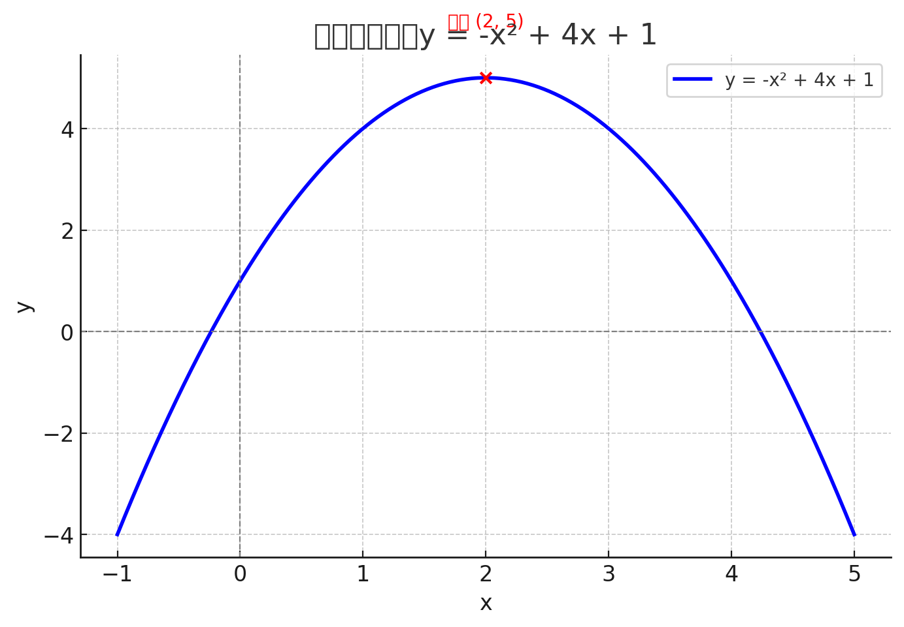
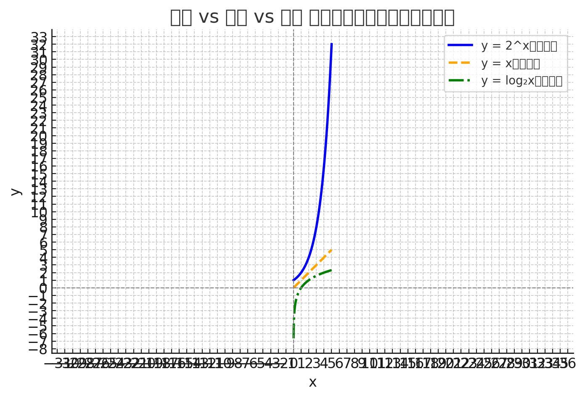
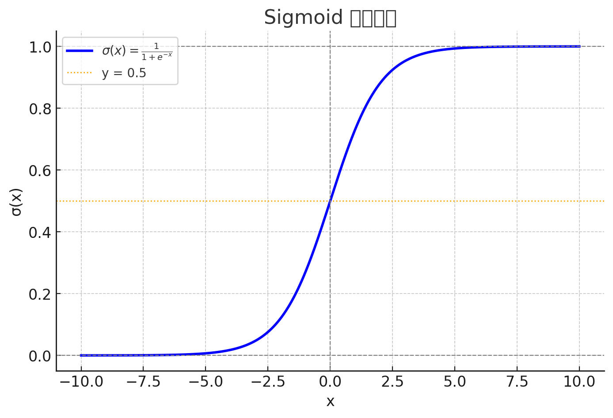

# 目录

[TOC]

# 概要

## 🧩 初等数学的必学概念（从零开始）

### 🟦 1. **数与运算基础**

| 概念         | 解释                                 |
|--------------|--------------------------------------|
| 自然数、整数、有理数、实数 | 数字的分类                            |
| 四则运算       | 加、减、乘、除的运算法则                    |
| 运算顺序（括号优先） | PEMDAS 原则（括号-指数-乘除-加减）         |
| 绝对值         | 表示一个数与 0 的距离，如 |−3| = 3       |
| 分数与小数     | 分数转换小数、无限循环小数                  |
| 百分比         | 利息、增长率、折扣等场景常用，例：30% = 0.3 |

---

### 🟦 2. **代数初步**

| 概念         | 解释                                       |
|--------------|--------------------------------------------|
| 变量与代数式   | 用字母表示未知数（如：x + 2 = 5）              |
| 解方程       | 一元一次方程、一元二次方程的解法               |
| 指数运算     | \(2^3 = 8\)，指数规则 \(a^m \cdot a^n = a^{m+n}\) |
| 对数概念     | log 是指数的“反函数”，如 \( \log_2(8) = 3 \)    |
| 括号展开与因式分解 | (x+1)(x+2) 展开为 \( x^2+3x+2 \)，反过来叫“因式分解” |

---

### 🟦 3. **函数与图像**

| 概念         | 解释                                     |
|--------------|------------------------------------------|
| 函数概念       | 每个输入 x 有唯一输出 y，y = f(x)             |
| 常见函数类型    | 线性函数、二次函数、指数函数、对数函数、分段函数 |
| 坐标系与图像    | 在 x-y 平面画出函数图像                      |
| 函数增长趋势    | 上升/下降、凹/凸、是否快速增长（如 log vs exp）|

---

### 🟦 4. **初等几何**

| 概念         | 解释                                     |
|--------------|------------------------------------------|
| 点、线、角、三角形 | 基础图形、角度计算、勾股定理                  |
| 圆的半径、直径、周长、面积 | \( C = 2\pi r \), \( A = \pi r^2 \)     |
| 面积与体积公式   | 矩形、圆、立方体、圆柱等常见形体              |
| 相似与全等     | 比例放大/缩小，几何推理基础                   |

---

### 🟦 5. **基础统计与数据概念**

| 概念       | 解释                                |
|------------|-------------------------------------|
| 平均数、中位数、众数 | 最基本的数据代表值                          |
| 数据可视化   | 画柱状图、折线图、饼图                        |
| 概率入门     | 掷骰子、抽卡、选人的基础概率计算                |

---

## ✨ 学习建议

- 每天学一点，每周复习总结一次
- 可以用图像和例子帮助理解（我可以帮你配图）
- 不必完美掌握，每块能看懂 70% 就足以继续往上学
- 遇到卡住的地方，随时来问我，我可以用**图、表、动画例子**讲解


# 课程结构

按“课本章节式”的方式，带你从**初等数学**系统学习，一步步建立扎实的数学基础。

---

## 📗 第1单元：数与四则运算

1.1 数的分类（自然数、整数、有理数、实数）  
1.2 四则运算规则（加减乘除的运算顺序）  
1.3 绝对值与相反数  
1.4 分数与小数的互化  
1.5 百分数与比（百分比、折扣、利率）

---

## 📘 第2单元：代数初步

2.1 变量与代数式  
2.2 一元一次方程的解法  
2.3 指数的运算规则  
2.4 对数的概念与基本性质  
2.5 因式分解与公式法则

---

## 📙 第3单元：函数与图像

3.1 函数的基本概念（输入、输出）  
3.2 坐标平面与函数图像  
3.3 线性函数与一次函数  
3.4 二次函数与抛物线  
3.5 对数函数与指数函数对比

---

## 📒 第4单元：初等几何基础

4.1 点、线、角、角度计算  
4.2 三角形与勾股定理  
4.3 圆的周长与面积  
4.4 常见图形面积与体积  
4.5 相似与全等、几何推理

---

## 📕 第5单元：基础统计与概率

5.1 平均数、中位数、众数  
5.2 简单的柱状图与数据可视化  
5.3 概率的定义与基本计算  
5.4 样本、实验、事件  
5.5 概率游戏与策略分析

---

## 🎯 学习方式建议：

每节课我会提供以下内容：

- ✅ 概念讲解（通俗易懂 + 举例）
- ✅ 图示（如有图形部分）
- ✅ 例题带练（你可选择跟做）
- ✅ 小测验（检验理解）

# 📗 第3单元：**函数与图像入门**

> 本单元将帮助你建立“函数思维”：
- 什么是函数？怎么表示？
- 怎么画出函数图像？  
- 了解一次函数、二次函数（抛物线）、指数函数、对数函数的图像和变化趋势。

---

## 📘 第3单元章节预览

| 章节编号 | 内容                         | 学习重点                           |
|----------|------------------------------|------------------------------------|
| 3-1️⃣     | 什么是函数？如何用图像表示？    | 映射、输入输出、坐标系              |
| 3-2️⃣     | 一次函数（直线）的表达与图像     | 斜率、截距、线性关系                |
| 3-3️⃣     | 二次函数（抛物线）的图像与变化   | 顶点、对称轴、开口方向               |
| 3-4️⃣     | 指数函数图像（增长）           | 快速增长、x 趋近时的变化趋势         |
| 3-5️⃣     | 对数函数图像（缓慢增长）        | 与指数函数的关系、log 特性图像理解    |

---

## 📘 第3单元 第1节：**什么是函数？如何用图像表示？**

---

### 🧠 一、函数的定义（通俗版）

> **函数就是一种“输入 → 输出”的规则**，  
> 每个输入（x）都有一个唯一的输出（y）

---

#### ✅ 数学表示法：

\[
y = f(x)
\]

- \( f \)：函数名，常常用 f、g、h
- \( x \)：自变量（输入）
- \( y \)：因变量（输出）

---

#### 🧃 生活中的例子：

| 输入 x（投入） | 输出 y（结果） | 函数说明                      |
|----------------|----------------|-------------------------------|
| 工人小时数      | 工资总额        | \( y = 100x \)（每小时100元）   |
| 天数           | 累计存款        | \( y = 10x + 100 \)（每天+10） |
| 气温           | 冰淇淋销量      | \( y = f(x) \)（关系可能非线性）|

---

### 📊 二、函数的表示方式（有 3 种）

| 表示方式 | 举例                                |
|----------|-------------------------------------|
| ✅ 解析式 | \( y = 2x + 1 \)（最常见）             |
| ✅ 表格   | 输入 x = 1, 2, 3 → y = 3, 5, 7      |
| ✅ 图像   | 在平面坐标系中画出点和曲线或直线        |

---

### 📐 三、坐标系基础：横轴 x，纵轴 y

函数图像是“所有 \( (x, f(x)) \)” 的点的集合  
我们画图时会将每个输入-输出对表示为一个点：

\[
x = 1 \Rightarrow y = 3 \Rightarrow 点 (1, 3)
\]

---

### 🧮 四、例子：函数 \( y = 2x + 1 \)

| x | y = 2x + 1 |
|---|------------|
| −1 | −1        |
| 0  | 1         |
| 1  | 3         |
| 2  | 5         |
| 3  | 7         |

→ 把这些点画在平面图上，就是一条**直线**（一次函数）

---

### ✏️ 五、练习题（写出 y 的值）

已知函数 \( y = 3x - 2 \)，请填出 y：

| x | y = 3x - 2 |
|---|------------|
| −1 | ?          |
| 0  | ?          |
| 1  | ?          |
| 2  | ?          |
| 3  | ?          |


---
**答案**:
-5
-2
1
4
7


##📘 第3单元 第2节：**一次函数的图像与变化规律**

---

### ✅ 一、一次函数的标准形式：

\[
y = mx + b
\]

- \( m \)：斜率（slope）——控制**倾斜程度**
- \( b \)：截距（intercept）——图像穿过 y 轴的位置（当 \( x = 0 \) 时）

---

#### 📈 示例 1：\( y = 2x + 1 \)

| x | y | 点坐标  |
|---|---|----------|
| −1 | −1 | (−1, −1) |
| 0  | 1  | (0, 1)   |
| 1  | 3  | (1, 3)   |
| 2  | 5  | (2, 5)   |

✅ 是一条向右上方倾斜的直线

---

#### ✅ 斜率 m 是什么？

\[
m = \frac{\Delta y}{\Delta x}
\]

> 意思是：**x 每增加 1，y 增加多少？**

- 如果 \( m > 0 \)：向上斜
- 如果 \( m < 0 \)：向下斜
- 如果 \( m = 0 \)：水平线

---

#### ✅ 截距 b 是什么？

- 当 \( x = 0 \) 时的 y 值 → 图像与 y 轴的交点  
- 例：\( y = 2x + 1 \)，当 \( x = 0 \Rightarrow y = 1 \)，所以 y 轴交于 (0, 1)

---

#### 🧠 快速判断图像形状：

| 函数            | 斜率 m | 截距 b | 特点                |
|-----------------|--------|--------|---------------------|
| \( y = 2x + 1 \) | +2     | 1      | 向右上升             |
| \( y = -3x + 4 \) | −3     | 4      | 向右下降，穿过 (0, 4) |
| \( y = 0x + 2 \) | 0      | 2      | 水平线               |
| \( y = x \)      | 1      | 0      | 过原点，倾斜45°       |

---

#### ✏️ 练习题（判断斜率 & 截距 & 性质）

给定函数 \( y = -2x + 5 \)，请回答：

1. 斜率 m = ?  
2. 截距 b = ?  
3. 这条直线是向上倾斜还是向下？  
4. 当 \( x = 0 \)，y = ?  
5. 当 \( x = 2 \)，y = ?
---
**答案**:
1. -2
2. 5
3. 下
4. 5
5. 1

## 📘 第3单元 第3节：**二次函数与抛物线图像**


### 🧠 一、什么是二次函数？

> 二次函数的标准形式是：

\[
y = ax^2 + bx + c
\]

- \( a, b, c \)：都是常数（\( a ≠ 0 \)）
- **图像一定是抛物线（parabola）**

---

#### ✅ 关键性质：

| 元素       | 含义                         |
|------------|------------------------------|
| **顶点**     | 抛物线的最高或最低点               |
| **开口方向** | 由 \( a \) 决定，a > 0 向上，a < 0 向下 |
| **对称轴**   | 通过顶点的竖直线，公式如下          |
| **y 截距**  | 当 \( x = 0 \) 时的 y 值（即常数项 c） |

---

### 📐 二、顶点与对称轴的公式

给出函数：  
\[
y = ax^2 + bx + c
\]

#### ✅ 顶点横坐标公式：

\[
x_{\text{顶点}} = -\frac{b}{2a}
\]

再把这个 x 代入原式，算出 y

---

#### ✅ 对称轴：

\[
x = -\frac{b}{2a} \quad \text{（就是顶点的 x）}
\]

---

#### ✅ 开口方向：

- 若 \( a > 0 \) → 开口向上（“笑脸”😊）
- 若 \( a < 0 \) → 开口向下（“苦脸”☹️）

---

### 🧪 三、例题演示

#### 例：函数 \( y = x^2 - 4x + 3 \)

- a = 1, b = −4, c = 3  
- 顶点 x：
  \[
  x = -\frac{-4}{2 \cdot 1} = 2
  \]  
- 顶点 y：
  \[
  y = (2)^2 - 4 \cdot 2 + 3 = 4 - 8 + 3 = -1
  \]
- 所以顶点坐标为：**(2, −1)**  
- 开口向上 ✅

---

### ✏️ 四、练习题

给定函数 \( y = -x^2 + 4x + 1 \)

请你回答：

1. a, b, c 分别是多少？  
2. 顶点的 x 坐标是？  
3. 顶点的 y 坐标是？  
4. 对称轴是？  
5. 开口方向是向上还是向下？
---
**答案：**

1. -1,4,1
2. 2
3. 5
4. x=2
5. 向下

---

## 📘 第3单元 第4节：**指数函数图像与变化趋势**

---

### ✅ 一、什么是指数函数？

> 指数函数的一般形式：

\[
y = a^x \quad (a > 0, a \ne 1)
\]

- \( x \) 是指数，a 是底数
- 图像表示的是“底数 a 的 x 次方”的增长过程

---

### 📈 二、图像的基本特点（以 \( y = 2^x \) 为例）

| 特征           | 说明                               |
|----------------|------------------------------------|
| 恒大于 0        | \( y = a^x > 0 \)（永不为负）         |
| 增长迅速        | \( x \) 增大时，y 快速变大             |
| 渐近于 x 轴     | 当 \( x \to -\infty \)，y → 0       |
| 过点 \( (0, 1) \) | 因为 \( a^0 = 1 \)                   |

---

#### 🧠 快速比较：

| 函数        | 类型     | 特征             |
|-------------|----------|------------------|
| \( y = 2^x \) | 指数增长 | 非常快（翻倍式）     |
| \( y = x \)   | 线性增长 | 稳定直线            |
| \( y = \log x \) | 对数增长 | 非常慢（越长越平）     |

---

### 🪜 三、几组典型值（以 \( y = 2^x \) 为例）

| x     | \( 2^x \) | 解释         |
|-------|-----------|--------------|
| −2    | 0.25      | \( 1/4 \)    |
| −1    | 0.5       | \( 1/2 \)    |
| 0     | 1         | \( 2^0 = 1 \)|
| 1     | 2         |              |
| 2     | 4         |              |
| 3     | 8         |              |
| 10    | 1024      | 急速上升 🚀 |

---

### 📈 四、常见指数函数图像形状

| 函数形式        | 图像特点                     |
|------------------|------------------------------|
| \( y = 2^x \)     | 过 (0,1)，向右爆炸性上升           |
| \( y = 0.5^x \)   | 过 (0,1)，向右迅速下降（指数衰减） |

---

### ✏️ 五、练习题（填空）

1. \( 3^0 = \)  
2. \( 2^{-3} = \)  
3. \( y = 2^x \) 中，当 x = −2 时，y = ?  
4. 指数函数 \( y = 2^x \) 的图像是否过点 (0, 1)？  
5. 哪个增长更快？\( y = 2^x \) vs \( y = x \)

---
1. 1
2. 1/8
3. 1/4
4. yes
5. \(y=2^x\)

### 📊 图像解读：指数 vs 线性 vs 对数

---

### 🔵 蓝色曲线：\( y = 2^x \)（指数函数）

- 快速上升（越往右增长越快）
- **爆炸式增长**

---

### 🟠 橙色虚线：\( y = x \)（线性函数）

- 均匀上升，每次增加一样多
- 图像是一条直线

---

### 🟢 绿色点划线：\( y = \log_2 x \)（对数函数）

- **增长很慢**
- 越往右上升越平缓
- 在 \( x = 1 \) 处过点 (1, 0)
- 是指数函数 \( y = 2^x \) 的**反函数**

---

## 🔁 直观总结

| 特征           | 指数 \( y = 2^x \) | 线性 \( y = x \) | 对数 \( y = \log_2 x \) |
|----------------|--------------------|------------------|--------------------------|
| 初期增长       | 慢                 | 均匀             | 快（从无穷负值冲上来）   |
| 长期增长       | 快速爆炸           | 稳定线性         | 越来越慢（趋于平坦）     |
| x 趋近 0 行为  | → 0（右下角）      | → 0              | → −∞（左下掉）           |


## 📘 什么是 **Sigmoid 函数**？

#### ✅ 定义：

Sigmoid 是一个**S 形的平滑曲线函数**，公式如下：

\[
\sigma(x) = \frac{1}{1 + e^{-x}}
\]

- 它将任何实数输入 \( x \) 映射到 \( (0, 1) \) 区间  
- 是一种**压缩函数（squashing function）**

---

### 🎯 为什么叫 "Sigmoid"？

- “Sigmoid” 来自拉丁语 **“sigmoides”**，意思是**“像 S 的形状”**
- 图像曲线呈现一个平滑的 **S 形弯曲**

---

### 📈 图像特点

| 特征             | 数值表现                        |
|------------------|---------------------------------|
| 函数值范围        | \( 0 < \sigma(x) < 1 \)         |
| 中心点           | \( \sigma(0) = 0.5 \)           |
| 左侧极限         | \( x \to -\infty \Rightarrow \sigma(x) \to 0 \)  
| 右侧极限         | \( x \to +\infty \Rightarrow \sigma(x) \to 1 \)  
| 对称性           | 关于原点对称（**偶函数**）



这是 **Sigmoid 函数** \( \sigma(x) = \frac{1}{1 + e^{-x}} \) 的图像 ✅

---

### 📈 图像解读：

- 📍 **中点：** \( x = 0 \) 时，\( \sigma(x) = 0.5 \)（图中橙色虚线标出）
- 📈 **右侧趋势：** x 越大，σ(x) 趋近于 1（但永远不会等于 1）
- 📉 **左侧趋势：** x 越小，σ(x) 趋近于 0
- 🌟 曲线光滑、连续且单调递增（始终上升）

---

### ✨ 动态变化理解：

- 小 x → σ(x) 接近 0（概率低）
- x = 0 → σ(x) = 0.5（最不确定）
- 大 x → σ(x) 接近 1（概率高）

---

### 🤖 在机器学习中的作用

| 应用场景              | 说明                                       |
|-----------------------|--------------------------------------------|
| **Logistic 回归**     | 将模型输出转换为概率（分类）                   |
| **神经网络激活函数**   | 控制神经元的输出在 0 和 1 之间，避免爆炸或消失     |
| **概率建模**          | 理解为“属于类别1的概率”，适用于二分类问题          |

---

### 🧠 直观理解：

- 输入 \( x = 0 \) → 输出 0.5（最不确定）  
- \( x \gg 0 \) → 接近 1（非常可能）  
- \( x \ll 0 \) → 接近 0（非常不可能）

---

#### 🧪 示例：

| x     | \( \sigma(x) \)      |
|--------|----------------------|
| −3     | ≈ 0.047              |
| −1     | ≈ 0.268              |
| 0      | 0.5                  |
| 1      | ≈ 0.731              |
| 3      | ≈ 0.953              |

---

### 📉 和对数的关系

Sigmoid 是**logistic 函数**，其反函数就是 **logit 函数**：

\[
\text{logit}(p) = \log\left(\frac{p}{1 - p}\right)
\]

→ 用于将概率转换回 logits（线性模型输出）


## 📗 第3单元总结：**函数与图像入门**

---

### ✅ 一、核心概念总览

| 概念       | 关键词       | 图像特征                      |
|------------|--------------|-------------------------------|
| 函数       | 输入 → 输出   | 每个 x 对应唯一 y                |
| 一次函数   | \( y = mx + b \) | 直线，斜率决定倾斜，b 为截距       |
| 二次函数   | \( y = ax^2 + bx + c \) | 抛物线，开口方向由 a 决定          |
| 指数函数   | \( y = a^x \)  | 快速增长，过 (0, 1)              |
| 对数函数   | \( y = \log_a x \) | 缓慢增长，过 (1, 0)，反函数为指数 |

---

### ✅ 二、图像比较回顾

| 类型       | 增长速度        | 开始点         | 特殊点           |
|------------|----------------|----------------|------------------|
| 一次函数   | 均匀           | 拟线性（可上/下）| y = x 过原点     |
| 二次函数   | 抛物线         | 有最小/最大值     | 顶点公式 \( x = -\frac{b}{2a} \) |
| 指数函数   | 非常快         | 慢起快上         | \( y = a^x \)，过 (0, 1)     |
| 对数函数   | 非常慢         | 快起慢上         | \( y = \log_a x \)，过 (1, 0) |

---

### ✅ 三、常见形式小抄

| 函数类型 | 通用形式         | 关键点                   |
|----------|------------------|--------------------------|
| 一次函数 | \( y = mx + b \)  | 斜率 m，截距 b            |
| 二次函数 | \( y = ax^2 + bx + c \) | 顶点 \( x = -\frac{b}{2a} \) |
| 指数函数 | \( y = a^x \)     | 快速增长，永远 > 0         |
| 对数函数 | \( y = \log_a x \) | 非常慢，x 趋近 0 时 → −∞     |

---

## ✍️ 第3单元综合测验（总分 100 分）

---

### ✅ 选择题（每题 10 分，共 5 题）

1️⃣ 下列哪一个函数图像是抛物线？  
A. \( y = 2x \)  
B. \( y = x^2 - 4x + 3 \)  
C. \( y = 2^x \)  
D. \( y = \log_2 x \)

---

2️⃣ 函数 \( y = 3x - 2 \) 的斜率是多少？  
A. 3  
B. −2  
C. 1  
D. 无法确定

---

3️⃣ 指数函数 \( y = 2^x \) 的图像通过哪个点？  
A. (1, 2)  
B. (0, 0)  
C. (1, 1)  
D. (0, 2)

---

4️⃣ 对数函数 \( y = \log_2 x \) 在 x → 0⁺ 时趋近于？  
A. 1  
B. −∞  
C. ∞  
D. 0

---

5️⃣ 函数 \( y = -x^2 + 4x + 1 \) 的顶点横坐标是？  
A. 2  
B. −2  
C. 1  
D. 0

---

### ✅ 计算与判断题（每题 10 分，共 5 题）

6️⃣ 给定函数 \( y = 2x + 3 \)，当 x = 4 时，y = ?

7️⃣ 判断函数 \( y = 2^x \) 和 \( y = \log_2 x \) 是否在点 (1, 1) 相交？说明理由。

8️⃣ 二次函数 \( y = x^2 - 6x + 8 \) 的顶点坐标是？

9️⃣ \( \log_2(1/8) = ? \)

🔟 从图像上看：哪个函数增长得比一次函数快？  
A. 对数函数 B. 常数函数 C. 二次函数 D. 指数函数

---

**答题：**
```
1. B
2. A
3. A
4. B
5. A
6. 11
7. 不相交，两个函数本身都不通过(1,1)
8. (3,-1)
9. -3
10. D
```