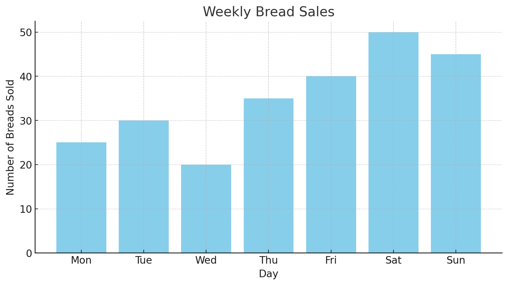
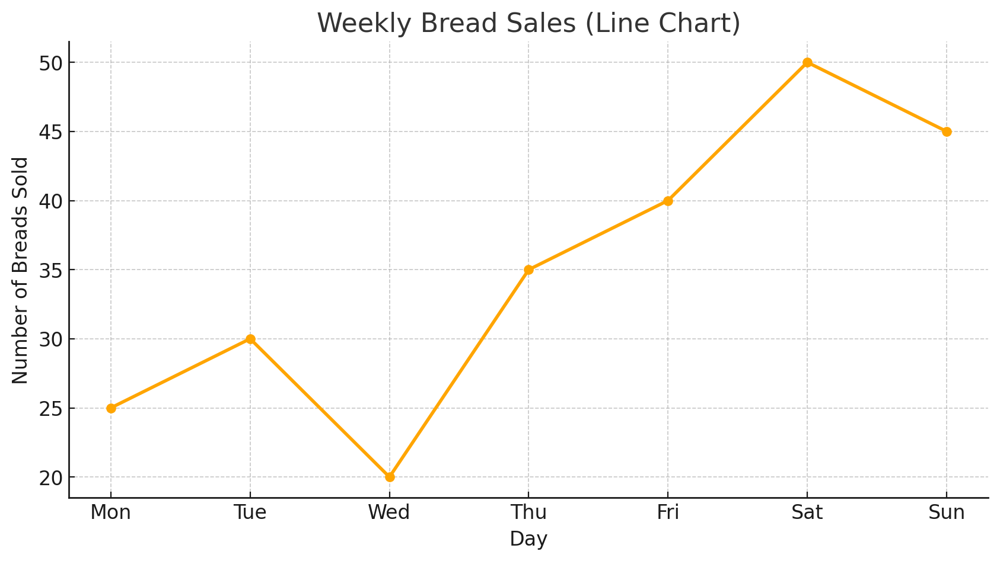
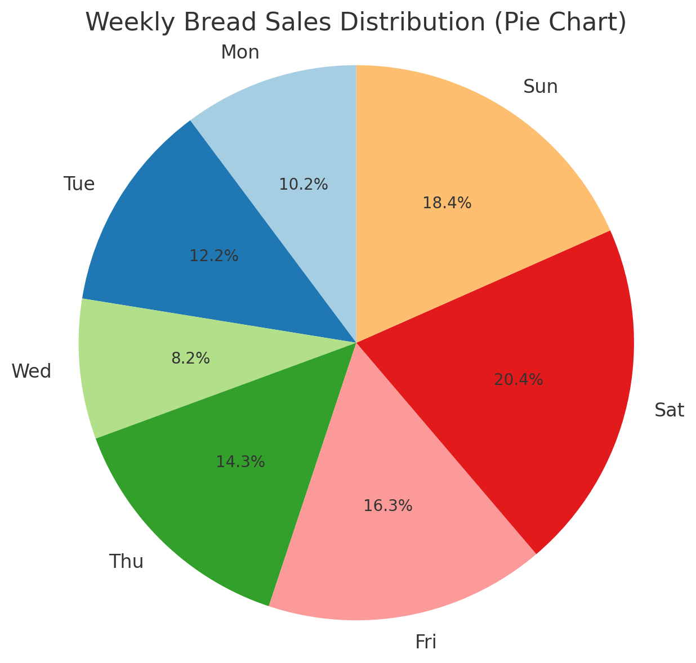

* content
{:toc}

[TOC]
# 概要

## 🧩 初等数学的必学概念（从零开始）

### 🟦 1. **数与运算基础**

| 概念         | 解释                                 |
|--------------|--------------------------------------|
| 自然数、整数、有理数、实数 | 数字的分类                            |
| 四则运算       | 加、减、乘、除的运算法则                    |
| 运算顺序（括号优先） | PEMDAS 原则（括号-指数-乘除-加减）         |
| 绝对值         | 表示一个数与 0 的距离，如 |−3| = 3       |
| 分数与小数     | 分数转换小数、无限循环小数                  |
| 百分比         | 利息、增长率、折扣等场景常用，例：30% = 0.3 |

---

### 🟦 2. **代数初步**

| 概念         | 解释                                       |
|--------------|--------------------------------------------|
| 变量与代数式   | 用字母表示未知数（如：x + 2 = 5）              |
| 解方程       | 一元一次方程、一元二次方程的解法               |
| 指数运算     | \(2^3 = 8\)，指数规则 \(a^m \cdot a^n = a^{m+n}\) |
| 对数概念     | log 是指数的“反函数”，如 \( \log_2(8) = 3 \)    |
| 括号展开与因式分解 | (x+1)(x+2) 展开为 \( x^2+3x+2 \)，反过来叫“因式分解” |

---

### 🟦 3. **函数与图像**

| 概念         | 解释                                     |
|--------------|------------------------------------------|
| 函数概念       | 每个输入 x 有唯一输出 y，y = f(x)             |
| 常见函数类型    | 线性函数、二次函数、指数函数、对数函数、分段函数 |
| 坐标系与图像    | 在 x-y 平面画出函数图像                      |
| 函数增长趋势    | 上升/下降、凹/凸、是否快速增长（如 log vs exp）|

---

### 🟦 4. **初等几何**

| 概念         | 解释                                     |
|--------------|------------------------------------------|
| 点、线、角、三角形 | 基础图形、角度计算、勾股定理                  |
| 圆的半径、直径、周长、面积 | \( C = 2\pi r \), \( A = \pi r^2 \)     |
| 面积与体积公式   | 矩形、圆、立方体、圆柱等常见形体              |
| 相似与全等     | 比例放大/缩小，几何推理基础                   |

---

### 🟦 5. **基础统计与数据概念**

| 概念       | 解释                                |
|------------|-------------------------------------|
| 平均数、中位数、众数 | 最基本的数据代表值                          |
| 数据可视化   | 画柱状图、折线图、饼图                        |
| 概率入门     | 掷骰子、抽卡、选人的基础概率计算                |

---

## ✨ 学习建议

- 每天学一点，每周复习总结一次
- 可以用图像和例子帮助理解（我可以帮你配图）
- 不必完美掌握，每块能看懂 70% 就足以继续往上学
- 遇到卡住的地方，随时来问我，我可以用**图、表、动画例子**讲解

# 课程结构

按“课本章节式”的方式，带你从**初等数学**系统学习，一步步建立扎实的数学基础。

---

## 📗 第1单元：数与四则运算

1.1 数的分类（自然数、整数、有理数、实数）  
1.2 四则运算规则（加减乘除的运算顺序）  
1.3 绝对值与相反数  
1.4 分数与小数的互化  
1.5 百分数与比（百分比、折扣、利率）

---

## 📘 第2单元：代数初步

2.1 变量与代数式  
2.2 一元一次方程的解法  
2.3 指数的运算规则  
2.4 对数的概念与基本性质  
2.5 因式分解与公式法则

---

## 📙 第3单元：函数与图像

3.1 函数的基本概念（输入、输出）  
3.2 坐标平面与函数图像  
3.3 线性函数与一次函数  
3.4 二次函数与抛物线  
3.5 对数函数与指数函数对比

---

## 📒 第4单元：初等几何基础

4.1 点、线、角、角度计算  
4.2 三角形与勾股定理  
4.3 圆的周长与面积  
4.4 常见图形面积与体积  
4.5 相似与全等、几何推理

---

## 📕 第5单元：基础统计与概率

5.1 平均数、中位数、众数  
5.2 简单的柱状图与数据可视化  
5.3 概率的定义与基本计算  
5.4 样本、实验、事件  
5.5 概率游戏与策略分析

---

## 🎯 学习方式建议：

每节课我会提供以下内容：

- ✅ 概念讲解（通俗易懂 + 举例）
- ✅ 图示（如有图形部分）
- ✅ 例题带练（你可选择跟做）
- ✅ 小测验（检验理解）

---

# 📘 第5单元：**初等统计与概率入门**

> 本单元将帮助你掌握如何收集、整理、描述数据，并理解不确定事件的发生概率。

---

## ✅ 单元目标：

你将学会：

- 计算和解释平均数、中位数、众数
- 绘制和阅读条形图、折线图、饼图等
- 判断事件发生的可能性
- 计算简单概率

---

## 🧭 第5单元章节预览

| 章节编号 | 内容                             | 学习重点                            |
|----------|----------------------------------|-------------------------------------|
| 5-1️⃣     | 数据收集与条形图、折线图          | 如何整理数据、看图说话                 |
| 5-2️⃣     | 平均数、中位数、众数的计算        | 数据中心趋势的三种常用指标             |
| 5-3️⃣     | 简单概率与事件                    | 什么是“可能性”？如何用分数表示概率？     |
| 5-4️⃣     | 实验与理论概率                    | 实际试验 vs 理论计算的区别              |
| 5-5️⃣     | 事件的组合与互斥、必然与不可能     | 复杂事件之间的关系判断与加减概率法则      |

---

# 📘 第5单元 第1节：**数据收集与条形图、折线图**

---

## ✅ 一、什么是统计图表？

统计图是用图形**形象地表示数据**的方法，让我们更容易看出数据的趋势、差异与变化。

---

## 📊 二、常见统计图介绍

| 图表类型   | 特点与用途                          | 示例场景                  |
|------------|-------------------------------------|---------------------------|
| **条形图**   | 每条横向/纵向的柱表示一个项目的数据大小 | 比较班级人数、物品数量等        |
| **折线图**   | 用点连接成线，表示数据随时间或序列的变化 | 气温、身高、体重变化等         |
| **饼图**     | 用“饼块”显示各部分占整体的比例         | 比例结构（支出、时间分配等）    |

---

## 📋 三、如何收集和整理数据？

1. **明确问题**（想知道什么？）  
2. **设计调查或记录表**  
3. **收集原始数据**  
4. **整理成表格或频数分布表**  
5. **画图表示并分析数据**

---

### 🌰 示例数据：

“某店一周内卖出面包的数量如下表”

| 星期 | 卖出数量（个） |
|------|----------------|
| 一   | 25             |
| 二   | 30             |
| 三   | 20             |
| 四   | 35             |
| 五   | 40             |
| 六   | 50             |
| 日   | 45             |

---

## 📈 四、条形图 vs 折线图：什么时候用？

| 情况                     | 推荐图表   |
|--------------------------|------------|
| 比较不同项目             | 条形图     |
| 观察随时间变化的趋势       | 折线图     |
| 看各部分占比             | 饼图       |

---

## ✏️ 五、练习题（数据分析判断）

根据上面的“面包销售数据表”，请回答：

1. 一周中卖得最多的是哪一天？  
2. 一周中卖得最少的是哪一天？  
3. 卖出超过 40 个的有哪几天？  
4. 星期一和星期六相差多少个面包？  
5. 你推荐用哪种图表示这组数据？为什么？

---

## 📊 条形图示例

这就是你请求的**条形图示例**，表示“某店一周内面包的销售情况”：

- **最高销售**：星期六（Sat），50 个面包
- **最低销售**：星期三（Wed），20 个面包
- 整体趋势：周中偏低，周末逐渐上升，表现出典型的“周末消费高峰”

## 📈 折线图（Line Chart）

- 用于显示**时间序列变化趋势**  
- 可以清楚地看出周中销售波动，**周末明显上升**
- 特别适合分析“增长、下降、波动”等动态趋势

---

## 🍕 饼图（Pie Chart）

- 每一块代表每天所占**总销售的比例**  
- 可直观看出哪天销售最多、占比最大  
- 适合看“比例结构”或“资源分配”

---

# 📘 第5单元 第2节：**平均数、中位数、众数的计算**

---

## ✅ 一、平均数（Mean）

> 平均数是“把所有数平分”的结果，也就是“总和 ÷ 个数”

### 公式：

\[
\text{平均数} = \frac{\text{所有数据加起来的总和}}{\text{数据的个数}}
\]

---

### 🌰 例子：

数据：\[ 2, 4, 6, 8, 10 \]  
总和 = 30，个数 = 5  
\[
\text{平均数} = \frac{30}{5} = 6
\]

---

## ✅ 二、中位数（Median）

> 中位数是“中间那个数”，表示数据的**中心位置**

### 方法：

1. 先 **从小到大排序**
2. 数据个数为奇数 → 正中间那个数  
3. 数据个数为偶数 → 中间两个数的平均值

---

### 🌰 例子：

- 奇数个：\[ 1, 3, 5 \] → 中位数 = 3  
- 偶数个：\[ 2, 4, 6, 8 \] → 中位数 = \( (4 + 6)/2 = 5 \)

---

## ✅ 三、众数（Mode）

> 众数是数据中**出现次数最多的数**

### 特点：

- 可能有多个众数  
- 如果每个数都出现 1 次 → **没有众数**

---

### 🌰 例子：

\[ 1, 2, 2, 3, 4 \] → 众数 = 2  
\[ 5, 5, 7, 7, 9 \] → 众数 = 5 和 7（双众数）

---

## ✏️ 四、练习题

数据集：\[ 6, 3, 8, 6, 2, 9, 6, 4 \]

请你计算：

1. 平均数 = ?  
2. 中位数 = ?  
3. 众数 = ?

---
